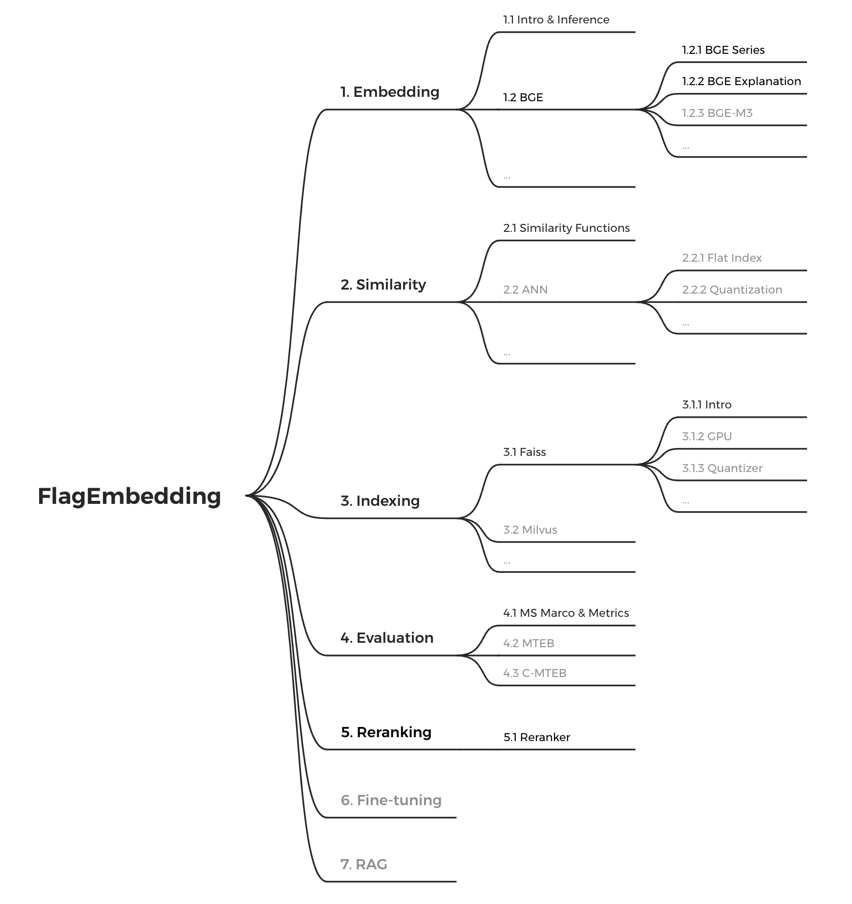

# FlagEmbedding_tutorial

FlagEmbedding holds a whole curriculum for retrieval, embedding models, RAG, etc. This section is currently being actively updated. No matter you are new to NLP or a veteran, we hope you can find something helpful!

If you are new to embedding and retrieval, check out the 5 minute [quick start](./quick_start.ipynb)!

  
Tutorial roadmap

    

## [Embedding](./1_Embedding)

This module includes tutorials and demos showing how to use BGE and Sentence Transformers, as well as other embedding related topics.

- [x] Intro to embedding model
- [x] BGE series
- [x] Usage of BGE
- [x] BGE-M3
- [ ] BGE-ICL

## [Similarity](./2_Similarity)

In this part, we show popular similarity functions and techniques about searching.

- [x] Similarity metrics
...

## [Indexing](./3_Indexing)

Although not included in the quick start, indexing is a very important part in practical cases. This module shows how to use popular libraries like Faiss and Milvus to do indexing.

- [x] Intro to Faiss
- [x] Using GPU in Faiss
- [ ] Index and Quantizer
- [ ] Milvus
...

## [Evaluation](./4_Evaluation)

In this module, we'll show the full pipeline of evaluating an embedding model, as well as popular benchmarks like MTEB and C-MTEB.

- [x] Evaluate MSMARCO
- [x] Intro to MTEB
- [x] MTEB Leaderboard Eval
- [ ] C-MTEB

## [Reranking](./5_Reranking/)

To balance accuracy and efficiency tradeoff, many retrieval system use a more efficient retriever to quickly narrow down the candidates. Then use more accurate models do reranking for the final results.

- [x] Intro to reranker